# Gümüş Takı Envanter Sistemi (Silver Jewelry Inventory System)

Bu proje, gümüş takı işletmeleri için özel olarak tasarlanmış kapsamlı bir envanter yönetim sistemidir. Ürün takibi, barkod işlemleri, tamirat yönetimi, satış takibi ve detaylı raporlama gibi modern ve kullanıcı dostu özellikler sunar.

(This project is a comprehensive inventory management system specially designed for silver jewelry businesses. It offers modern and user-friendly features such as product tracking, barcode operations, repair management, sales tracking, and detailed reporting.)

## Temel Özellikler (Key Features)

*   **Gösterge Paneli (Dashboard):** Envanter, tamirat ve son işlemler hakkında anlık genel bakış.
*   **Envanter Yönetimi (Inventory Management):**
    *   Kolay ve hızlı tekli veya toplu ürün ekleme.
    *   Detaylı ürün bilgileri (ağırlık, fiyat, maliyet, kategori, satın alma tarihi vb.).
    *   Gelişmiş filtreleme ve barkod ile ürün arama.
*   **Barkod İşlemleri (Barcode Operations):**
    *   Otomatik Data Matrix barkod oluşturma.
    *   Farklı şablonlarla tekli, toplu ve seçili ürünler için barkod yazdırma.
*   **Tamirat Yönetimi (Repair Management):**
    *   Yeni tamirat kaydı oluşturma ve müşteri takibi.
    *   Tamirat listesi ve anlık durum güncelleme (Beklemede, İşlemde, Tamamlandı, Teslim Edildi).
    *   Kolay tamirat teslim işlemleri.
*   **Satış Takibi (Sales Tracking):**
    *   Yapılan satışların listelenmesi ve detayları.
    *   Otomatik kâr/zarar hesaplaması (TRY bazında).
*   **Raporlama (Reporting):**
    *   Belirli tarih aralıkları için finansal özetler.
    *   Satılan ürünlerin ve tamirat gelirlerinin raporlanması.
*   **Kullanıcı Yönetimi (User Management):**
    *   Güvenli e-posta/şifre ile giriş.
    *   Kullanıcı profili ve çıkış işlemleri.
*   **Duyarlı Tasarım (Responsive Design):**
    *   Masaüstü ve mobil cihazlarda sorunsuz kullanıcı deneyimi.

## Ekran Görüntüleri (Screenshots)

Aşağıda uygulamanın çeşitli özelliklerini gösteren ekran görüntüleri bulunmaktadır:
(Below are screenshots showcasing various features of the application:)

---

**1. Gösterge Paneli (Dashboard Overview)**
*Genel envanter durumu, aktif tamiratlar ve son satış işlemlerine hızlı erişim sağlar.*
(Provides a quick overview of the general inventory status, active repairs, and recent sales transactions.)
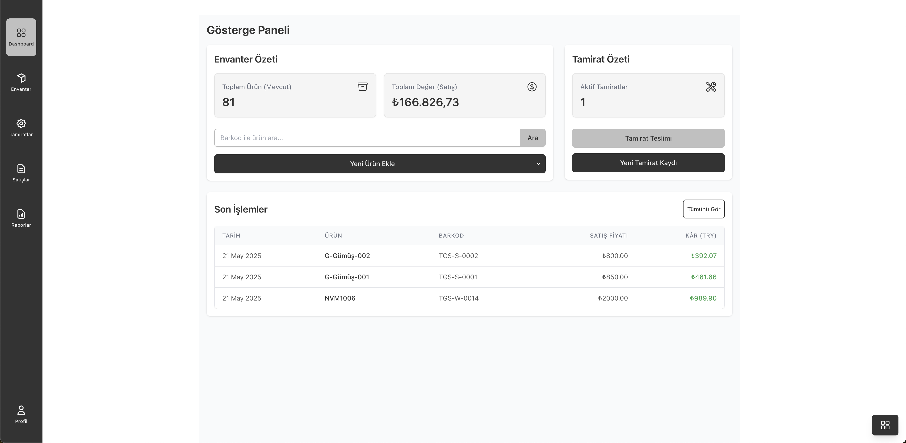

---

**2. Yeni Ürün Ekleme (Adding a New Product)**
*Detaylı ürün bilgilerinin (tip, barkod, kategori, ağırlık, fiyatlar vb.) girilebildiği modal.*
(Modal for entering detailed product information such as type, barcode, category, weight, prices, etc.)
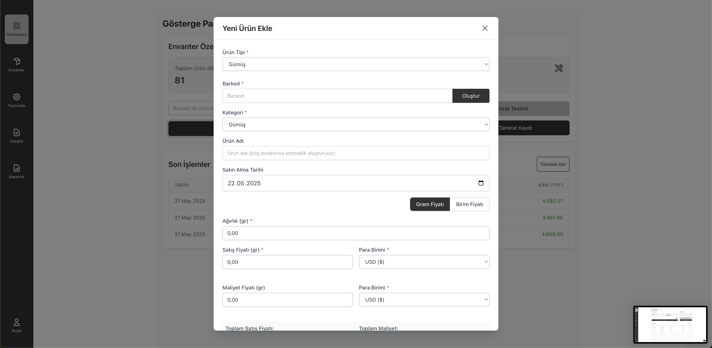

---

**3. Toplu Ürün Ekleme (Batch Product Entry)**
*Birden fazla ürünün aynı anda, tablo arayüzü üzerinden hızlıca eklenebilmesi.*
(Ability to quickly add multiple products simultaneously via a table interface.)
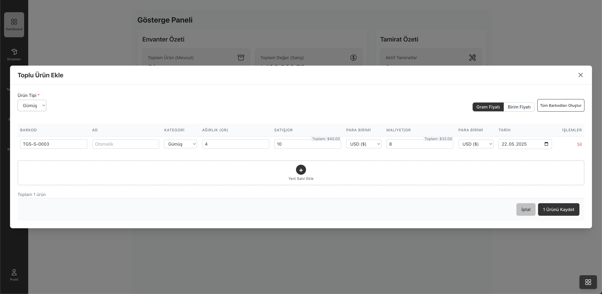

---

**4. Envanter Listesi ve Filtreleme (Inventory List & Filtering)**
*Tüm ürünlerin listelendiği, durum, tip, kategori, tarih ve fiyat aralığına göre filtrelenebildiği sayfa.*
(Page where all products are listed and can be filtered by status, type, category, date, and price range.)
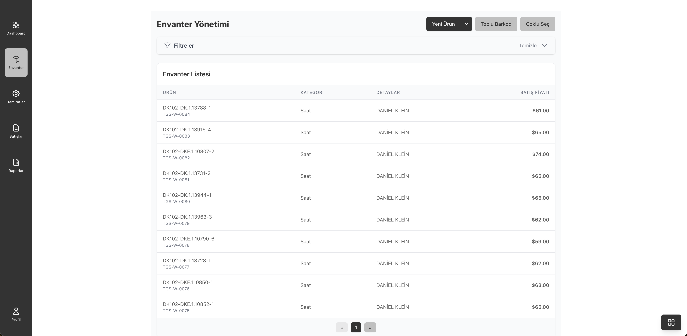

---

**5. Toplu Barkod Oluşturma ve Yazdırma (Batch Barcode Generation & Printing)**
*Belirli sayıda yeni barkodun otomatik olarak üretilip, seçilen şablona göre yazdırılabilmesi.*
(Automatic generation of a specific number of new barcodes and printing them according to the selected template.)
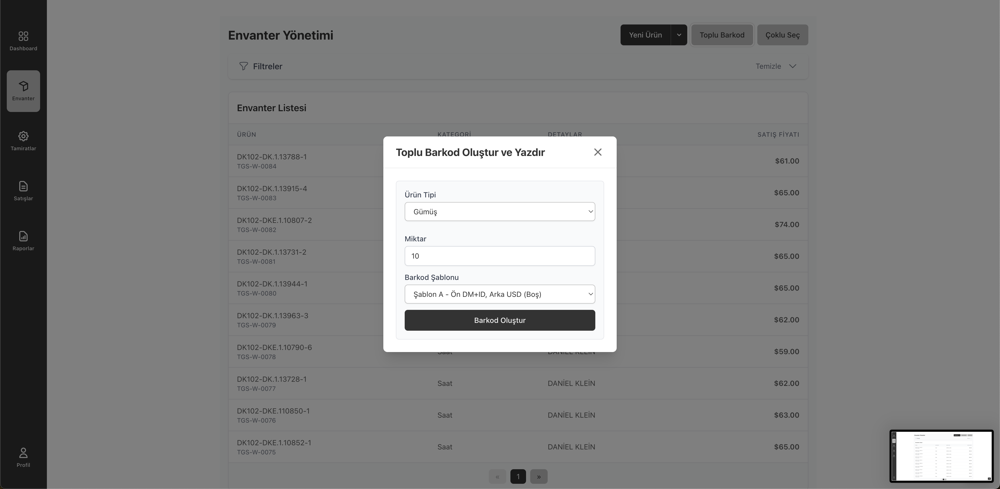

---

**6. Seçili Ürünler İçin Barkod Yazdırma (Printing Barcodes for Selected Items)**
*Envanter listesinden seçilen birden fazla ürün için toplu barkod yazdırma özelliği.*
(Batch barcode printing feature for multiple items selected from the inventory list.)
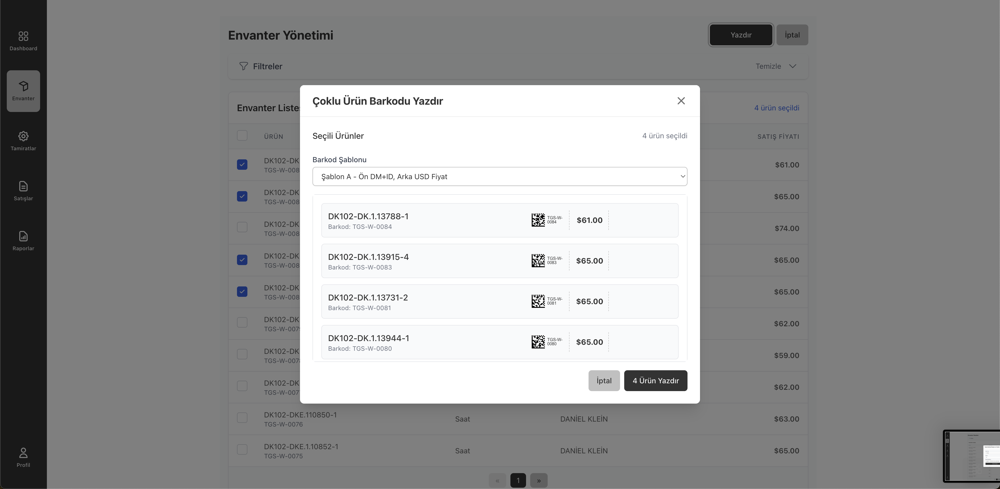

---

**7. Yeni Tamirat Kaydı (New Repair Intake)**
*Müşteri bilgileri (telefon ile arama/yeni kayıt) ve tamir edilecek ürün detaylarının girildiği form.*
(Form for entering customer information (search by phone/new record) and details of the item to be repaired.)
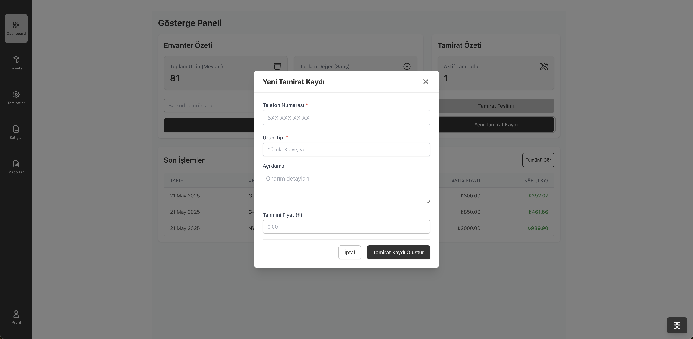

---

**8. Tamirat Yönetimi Listesi (Repair Management List)**
*Tüm tamirat kayıtlarının müşteri, açıklama ve durum bilgileriyle listelenmesi.*
(Listing of all repair records with customer, description, and status information.)
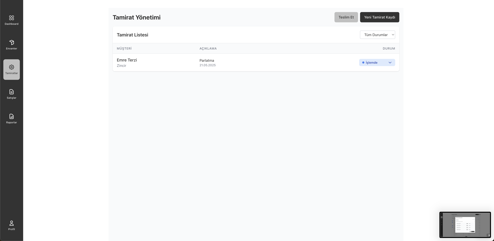

---

**9. Tamirat Teslim İşlemleri (Repair Pickup Process)**
*Tamamlanan tamiratların müşteriye teslim edilmesi ve ücretinin kaydedilmesi.*
(Process of delivering completed repairs to the customer and recording the fee.)
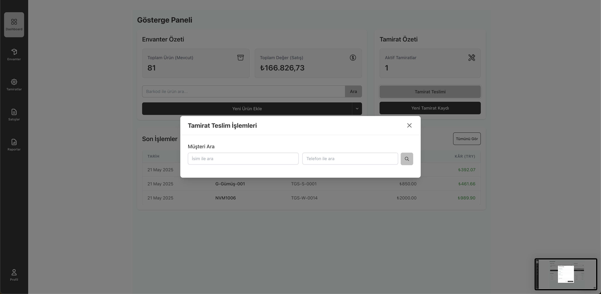

---

**10. Satış İşlemleri Listesi (Sales Transactions List)**
*Gerçekleşen tüm satışların ürün adı, barkodu, satış fiyatı, maliyeti ve kârı ile birlikte listelenmesi.*
(Listing of all completed sales with product name, barcode, selling price, cost, and profit.)
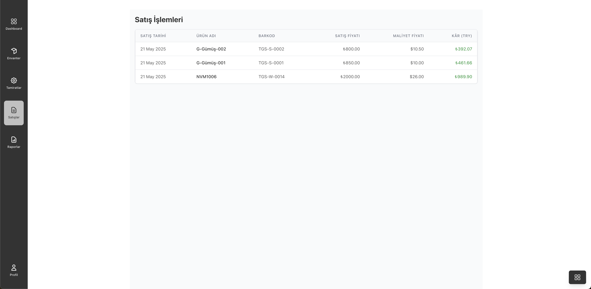

---

**11. Raporlama Arayüzü (Reporting Interface)**
*Belirli tarih aralıklarında finansal özetlerin (toplam satış, maliyet, kâr) ve satılan ürün listesinin görüntülendiği bölüm.*
(Section where financial summaries (total sales, cost, profit) and the list of sold items for specific date ranges are displayed.)
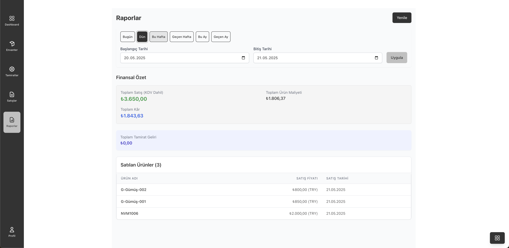

---

**12. Mobil Gösterge Paneli (Mobile Dashboard - Responsive Design Example)**
*Uygulamanın mobil cihazlarda da kullanıcı dostu bir deneyim sunduğunu gösteren örnek bir ekran.*
(An example screen showing that the application offers a user-friendly experience on mobile devices as well.)
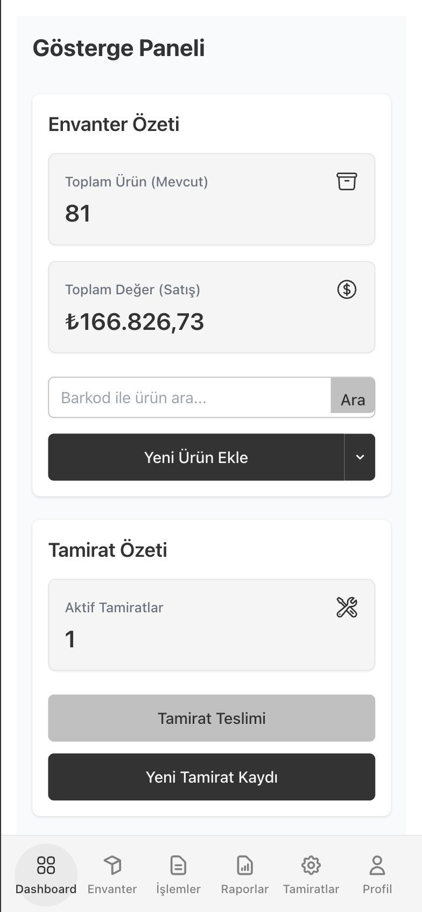

---

## Kullanılan Teknolojiler (Technologies Used)

*   **Frontend:** React, TypeScript, Vite, Tailwind CSS
*   **Backend & Veritabanı (Database):** Firebase (Firestore, Authentication)
*   **Barkod (Barcode Generation):** bwip-js (Data Matrix format)

## Proje Amacı (Project Goal)

Bu sistem, gümüş ve takı sektöründeki işletmelerin envanter yönetimi, ürün takibi, tamirat süreçleri ve satış analizleri gibi operasyonel ihtiyaçlarını dijital ortamda verimli bir şekilde yönetmelerini sağlamak amacıyla geliştirilmiştir. Kullanıcı dostu arayüzü ve kapsamlı özellikleriyle işletmelerin zaman kazanmasına ve iş süreçlerini optimize etmesine yardımcı olmayı hedefler.

(This system was developed to enable businesses in the silver and jewelry sector to efficiently manage their operational needs such as inventory management, product tracking, repair processes, and sales analysis in a digital environment. With its user-friendly interface and comprehensive features, it aims to help businesses save time and optimize their business processes.)

---
*(İsteğe bağlı: İletişim bilgilerinizi veya GitHub profilinize bir bağlantı ekleyebilirsiniz.)*
*(Optional: You can add your contact information or a link to your GitHub profile.)*